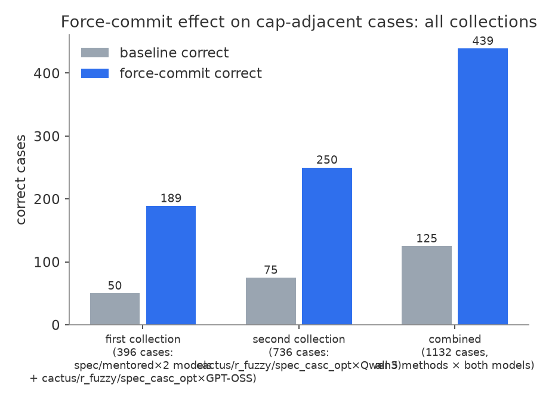
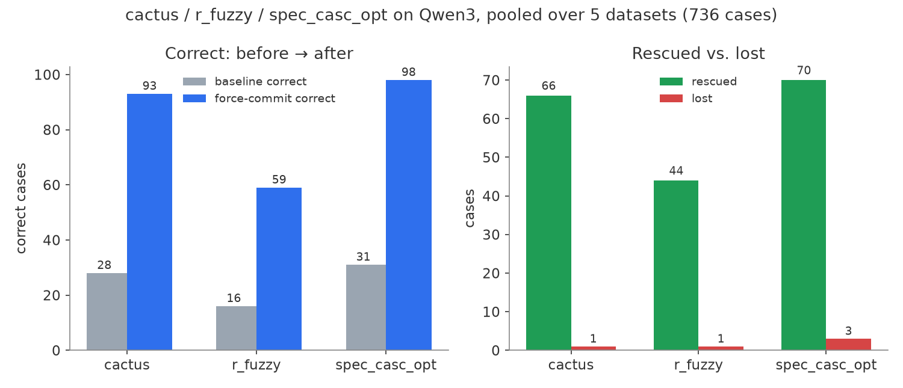
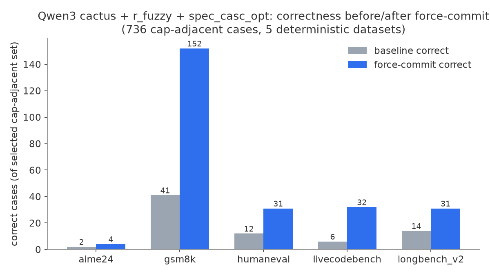
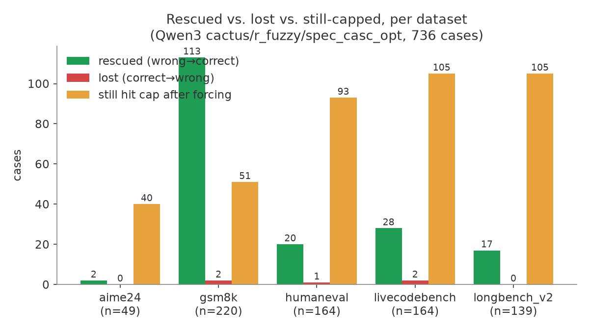

# Force-commit as a non-termination backstop: cap-hit results across 5 methods, 2 models

**Date:** 2026-10-09
**Scope:** `spec_casc_tok`, `mentored_dec`, `cactus`, `r_fuzzy`, `spec_casc_opt` — on both GPT-OSS and Qwen3-8B, across 5 deterministic-answer datasets (aime24, gsm8k, humaneval, livecodebench, longbench_v2). mtbench excluded (no deterministic grading).
**Full methodology, caveats, and per-arm breakdowns:** [`FINDINGS_cross_method.md`](../FINDINGS_cross_method.md)

## TL;DR

Force-commit — forcibly closing the reasoning block (harmony boundary / Qwen3 `</think>`) once a trajectory crosses a per-dataset token threshold without finishing — rescues far more cap-hit cases than it breaks, across **every method and both models tested**.

| | selected (cap-adjacent) cases | correct before → after | rescued | lost | still hit cap |
|---|--:|--:|--:|--:|--:|
| **Combined, all 5 methods × both models** | **1,132** | **125 → 439** | **336** | **22** | **515** |

Rescued : lost ≈ **15 : 1**. Regression rate stays under 3% of the selected (adversarial-by-construction) slice even as more aggressive methods roughly triple the rescue population.

## Two collection runs

1. **First collection (396 cases):** `spec_casc_tok` + `mentored_dec` on both Qwen3 and GPT-OSS, plus `cactus`/`r_fuzzy`/`spec_casc_opt` on GPT-OSS only — because the Qwen3 force-commit hook was initially assumed to support only the two "spec" methods.
2. **Second collection (736 cases, this report's focus):** after confirming the Qwen3 hook is architecturally method-agnostic (it patches a file downstream of method-specific verification, which no per-method patch touches — see below), extended to `cactus`/`r_fuzzy`/`spec_casc_opt` on Qwen3 too. These methods are more aggressive (higher alpha) and hit the cap far more often at baseline, so this collection is nearly 2× the size of the first.

| collection | cases | correct before → after | rescued | lost |
|---|--:|--:|--:|--:|
| first (396) | 396 | 50 → 189 | 156 | 17 |
| second (736) | 736 | 75 → 250 | 180 | 5 |
| **combined** | **1,132** | **125 → 439** | **336** | **22** |

## Why the Qwen3 hook generalizes

The Qwen3 force-commit patch lives in `vllm/v1/worker/gpu/spec_decode/rejection_sampler.py` — a file sitting *downstream* of whichever verification method actually ran, inside the consolidated V2 sampling kernel. No per-method patch (`cactus`, `r_fuzzy`, `spec_casc_opt`, `spec_casc_tok`, `mentored_dec`) touches this file, so the force-commit decision operates generically on `processed_logits` after speculative sampling, before `rejection_sample(...)` — independent of which method selected those logits.

Confirmed with a 3-case GPU sanity check (threshold 2000, cap 4000, aime24) before committing to the full run: all three new methods correctly forced `</think>` at/after the threshold. Code: `scripts/fresh_server_replay.py` (commit `324068d31`).

## Threshold

Derived post-hoc as **cap − p95(post-boundary answer length)**, measured from each model's strict runs (chars→tokens at ~3.25 chars/token). Not pre-registered — flag as such in the paper. Replaces an earlier 0.9×cap rule that left too little room for the post-boundary answer on code/reasoning-heavy tasks and so still hit the cap too often.

| dataset | cap | Qwen3 threshold | GPT-OSS threshold |
|---|--:|--:|--:|
| aime24 | 32,768 | 31,260 | 31,605 |
| gsm8k | 2,048 | 1,684 | 2,002 |
| humaneval | 9,000 | 8,150 | 8,497 |
| livecodebench | 12,000 | 11,004 | 9,294 |
| longbench_v2 | 8,192 | 6,894 | 8,133 |

## Second collection results: cactus / r_fuzzy / spec_casc_opt on Qwen3 (736 cases)

By method (pooled over all 5 datasets):

| method | n | correct before → after | rescued | lost | still hit cap |
|---|--:|--:|--:|--:|--:|
| cactus | 245 | 28 → 93 | 66 | 1 | 149 |
| r_fuzzy | 214 | 16 → 59 | 44 | 1 | 108 |
| spec_casc_opt | 277 | 31 → 98 | 70 | 3 | 137 |
| **total** | **736** | **75 → 250** | **180** | **5** | **394** |

By dataset (pooled over all 3 methods):

**Reading:**
- **gsm8k rescues the large majority** of its selected cases (113/220, ~51%) — a short numeric answer almost always fits in the reclaimed budget once `</think>` is forced.
- **Code/long-context tasks still cap out often** after forcing: humaneval 93/164, livecodebench 105/164, longbench_v2 105/139. The model frequently re-derives or re-writes its solution after the forced boundary rather than emitting a short result, so reclaiming budget doesn't guarantee a finished answer.
- **cactus/longbench_v2 is the extreme case** — 75 of 89 selected cases still capped even after forcing — consistent with cactus being the most aggressive of the three methods here (alpha=0.35) and so having the most severely truncated baselines to rescue from.
- **r_fuzzy/livecodebench rescued zero cases** (0/55) — every one of its 55 selected cases was still capped or still wrong after forcing. The only dataset×method cell in either collection with no correct cases on either side.
- Losses are rare and small everywhere: 5 total across 736 cases, none concentrated in one arm.

## Caveats (see FINDINGS_cross_method.md for the full list)

- Selection is every cap-adjacent case by construction, not a random sample — per-cell n varies 13–102, so per-cell percentages aren't independently meaningful; only pooled totals are.
- Threshold is post-hoc, derived from the same strict runs used for grading elsewhere.
- Baselines for cactus/r_fuzzy/spec_casc_opt come from the original campaign `runs/` data (fresh-per-case); these methods were never rerun in-session, unlike spec_casc_tok/mentored_dec which have an in-session warm-rerun ledger baseline. Different provenance, same validity standard.
- All 736 new rows passed `record_valid: True` (Qwen3 hook validity is unconditional/stateless-per-request, no hash gate needed, unlike the GPT-OSS V1 patches).
- A grading-pipeline bug was found and corrected as a ledger-level rule throughout both collections: a capped Qwen3 run with no `</think>` was sometimes graded on its whole unfinished reasoning text and scored spuriously correct. Rule applied: `hit_cap and not think_close_seen` ⇒ incorrect.

## Where this lives

- Code: `scripts/fresh_server_replay.py` (`324068d31`), `autoresearch/cross_method_metrics.py` (`178342164`)
- Data: `autoresearch/cross_method_metrics/*.csv` (per-case ledger), `autoresearch/cross_method_runs/` (raw artifacts, gitignored)
- Full writeup with per-arm tables: `autoresearch/FINDINGS_cross_method.md`
