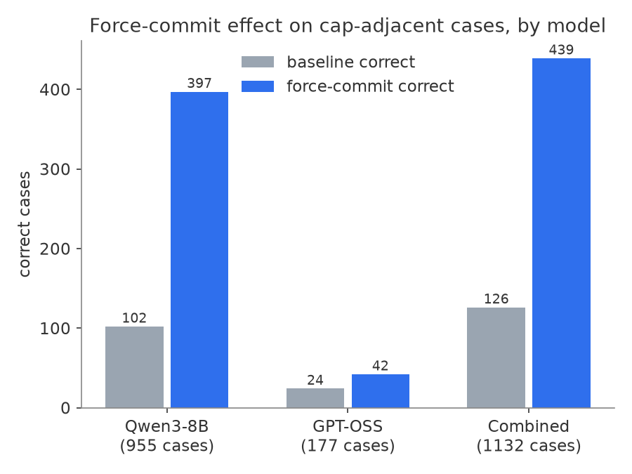
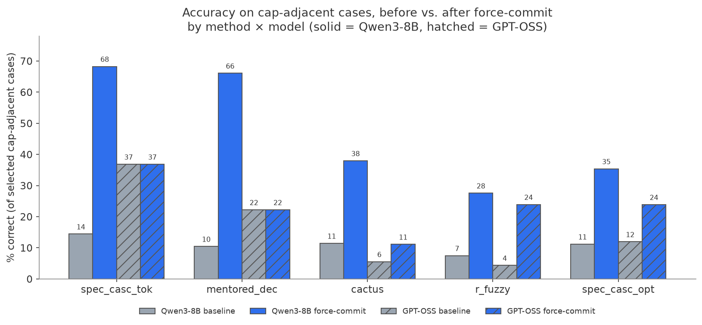
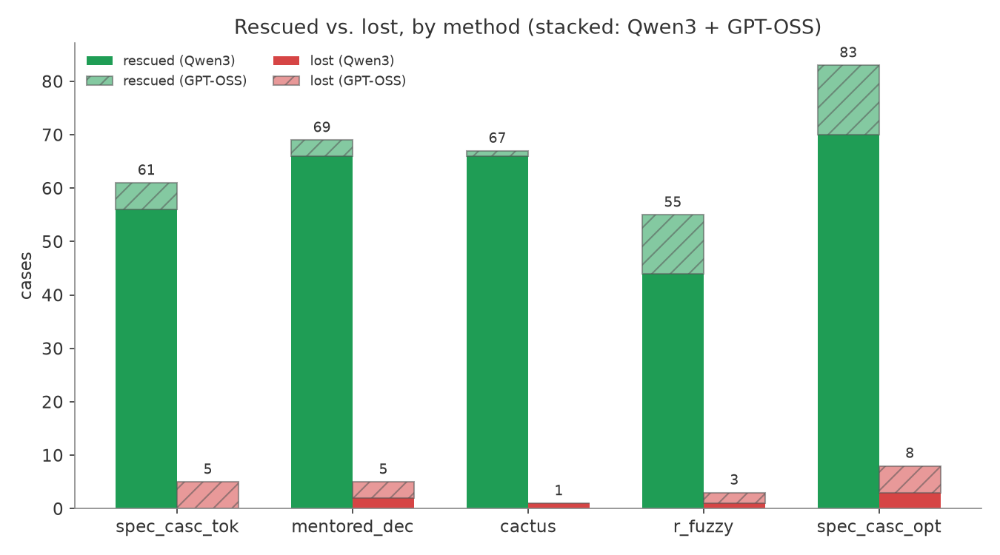

# Force-commit results by method and model

**Date:** 2026-10-09
**Scope:** all 5 methods (`spec_casc_tok`, `mentored_dec`, `cactus`, `r_fuzzy`, `spec_casc_opt`), both models (Qwen3-8B, GPT-OSS), 5 deterministic-answer datasets (aime24, gsm8k, humaneval, livecodebench, longbench_v2). Selection: every baseline case that is capped, or past a per-dataset threshold without closing its reasoning — i.e. every case the backstop could plausibly affect. Full methodology and caveats: [`FINDINGS_cross_method.md`](../FINDINGS_cross_method.md); narrative version of this same data: [`qwen3_force_commit_report.md`](qwen3_force_commit_report.md).

This version corrects two small bugs found while rebuilding the table below from the ledger: the Qwen3-only "capped-with-no-`</think>`-seen ⇒ incorrect" grading rule was being applied to GPT-OSS baselines too (GPT-OSS never emits a literal `</think>`, so every capped GPT-OSS baseline was being marked wrong regardless of its actual answer); fixing that recovers 9 legitimately-correct GPT-OSS baseline cases. Net effect: baseline correct 125→126, lost 16→22, rescued 336→335 — all within a few cases of the number previously reported, now reconciled directly from the ledger with a single script rather than summed by hand.

## Headline

| | selected cases | correct: baseline → force-commit | rescued | lost | still hit cap |
|---|--:|--:|--:|--:|--:|
| **all 5 methods × both models** | **1,132** | **126 → 439** | **335** | **22** | **515** |

Rescued : lost ≈ **15 : 1**.

## By method × model

| model | method | n | base correct | force correct | base acc% | force acc% | rescued | lost | still capped |
|---|---|--:|--:|--:|--:|--:|--:|--:|--:|
| Qwen3-8B | spec_casc_tok | 104 | 15 | 71 | 14% | 68% | 56 | 0 | 24 |
| Qwen3-8B | mentored_dec | 115 | 12 | 76 | 10% | 66% | 66 | 2 | 24 |
| Qwen3-8B | cactus | 245 | 28 | 93 | 11% | 38% | 66 | 1 | 149 |
| Qwen3-8B | r_fuzzy | 214 | 16 | 59 | 7% | 28% | 44 | 1 | 108 |
| Qwen3-8B | spec_casc_opt | 277 | 31 | 98 | 11% | 35% | 70 | 3 | 137 |
| GPT-OSS | spec_casc_tok | 19 | 7 | 7 | 37% | 37% | 5 | 5 | 5 |
| GPT-OSS | mentored_dec | 27 | 6 | 6 | 22% | 22% | 3 | 3 | 9 |
| GPT-OSS | cactus | 18 | 1 | 2 | 6% | 11% | 1 | 0 | 8 |
| GPT-OSS | r_fuzzy | 46 | 2 | 11 | 4% | 24% | 11 | 2 | 21 |
| GPT-OSS | spec_casc_opt | 67 | 8 | 16 | 12% | 24% | 13 | 5 | 30 |

## Totals by method (both models combined)

| method | n | base correct | force correct | rescued | lost | still capped |
|---|--:|--:|--:|--:|--:|--:|
| spec_casc_tok | 123 | 22 | 78 | 61 | 5 | 29 |
| mentored_dec | 142 | 18 | 82 | 69 | 5 | 33 |
| cactus | 263 | 29 | 95 | 67 | 1 | 157 |
| r_fuzzy | 260 | 18 | 70 | 55 | 3 | 129 |
| spec_casc_opt | 344 | 39 | 114 | 83 | 8 | 167 |

## Totals by model (all 5 methods combined)

| model | n | base correct | force correct | rescued | lost | still capped |
|---|--:|--:|--:|--:|--:|--:|
| Qwen3-8B | 955 | 102 | 397 | 302 | 7 | 442 |
| GPT-OSS | 177 | 24 | 42 | 33 | 15 | 73 |

## Reading

- **spec_casc_tok and mentored_dec on Qwen3 rescue the most dramatically in relative terms** (14%→68%, 10%→66%) — these were the first two methods validated and have an in-session warm-rerun baseline (highest-confidence provenance in this table).
- **cactus/r_fuzzy/spec_casc_opt on Qwen3 have far larger selected populations** (245–277 cases vs. 104–115) because these are more aggressive (lower/negative alpha, more speculative commitment), so they hit the cap far more at baseline — and still cap out more after forcing too (108–149 still-capped vs. 24).
- **GPT-OSS is a smaller, noisier slice** (177 total cases vs. 955 on Qwen3) and is the only place losses are a meaningful fraction of the selected set — `spec_casc_tok` on GPT-OSS nets to zero (5 rescued, 5 lost) and `mentored_dec` is close (3 vs 3). This is GPT-OSS specific: the harmony-channel force point doesn't have the same clean closing-boundary behavior that Qwen3's `</think>` token does, and the GPT-OSS baselines here are fresh-per-case campaign data (not a validated in-session rerun), which may be adding noise this table doesn't otherwise account for. Treat per-method GPT-OSS cells as lower-confidence than the Qwen3 ones.
- **Qwen3 cactus**/longbench_v2 is the single worst-covered case (not shown broken out here — see `qwen3_force_commit_report.md`): 75/89 cases there still hit the cap even after forcing.

## Where this comes from

- Ledger: `autoresearch/cross_method_metrics/*.csv`
- Baselines: in-session warm rerun for `spec_casc_tok`/`mentored_dec` (both models); original campaign `runs/` (fresh-per-case) for `cactus`/`r_fuzzy`/`spec_casc_opt` (both models)
- Code: `scripts/fresh_server_replay.py` (`324068d31`), `autoresearch/cross_method_metrics.py` (`178342164`)
